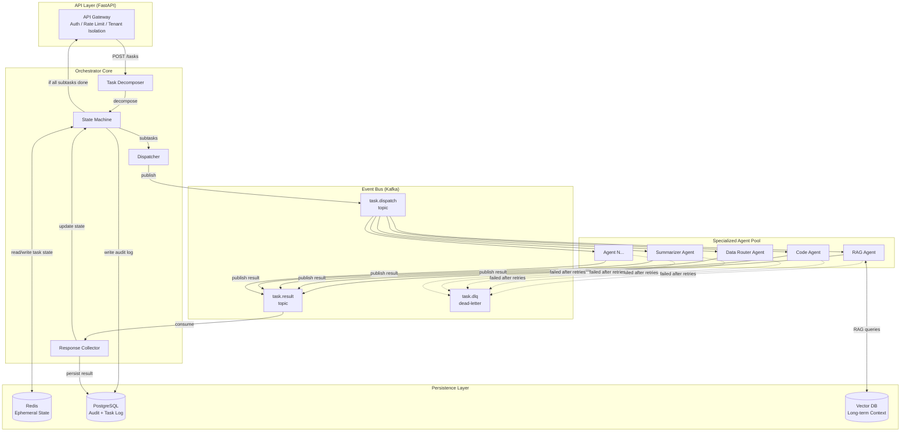

# Nexus Orchestrator — Architecture

## System Architecture (Mermaid)

## Data Flow Summary

1. **Ingest**: Client hits the API Gateway with a complex task payload.
2. **Decompose**: The Orchestrator's Task Decomposer breaks the payload into
   atomic subtasks using a DAG (directed acyclic graph) of dependencies.
3. **Dispatch**: Each subtask is serialized and published to the Kafka
   `task.dispatch` topic, keyed by `tenant_id` for ordered processing per tenant.
4. **Execute**: Specialized agents consume from their assigned partitions,
   execute, and publish results to `task.result`.
5. **Collect**: The Response Collector consumes results, updates the state
   machine in Redis, and writes audit records to PostgreSQL.
6. **Complete**: When all subtasks for a parent task reach terminal state
   (COMPLETED / FAILED), the orchestrator finalizes the response.

## Tenant Isolation Strategy

- Kafka partition key = `tenant_id` (ordering guarantee per tenant)
- Redis key prefix = `tenant:{tenant_id}:task:{task_id}`
- PostgreSQL Row-Level Security (RLS) on `tenant_id` column
- API Gateway extracts tenant from JWT and injects into request context